# RGB-LED-Matrix

Für mehr RGB-Blingbling im (Kinder)zimmer!

Ein kindergeeignetes Bastelprojekt mit einer minimalen Menge an Lötarbeit.

## Material

* LEDs "am Strang" (sucht im Netz nach "ws2811 fairy lights")
* ESP8266 (oder ESP32) für WLED
* Steckernetzteil 5 V, 3 A
* Passende Hohlbuchse
* Holz für Rückplatte: 1,5 mm Sperrholz, z.B. [von hier](https://www.fliegerlandshop.de/webshop/product_info.php?products_id=738)
* Mikrowellpappe 1,5 mm für Einfachungen und Rahmen, z.B. [von hier](https://www.architekturbedarf.de/pappe-+-papier/wellpappe/mikrowellpappe-weiss_weiss).
  Alternativ funktioniert natürlich auch Sperrholz selber Dicke.
* 16 Musterbeutel-Klammern (kennt man vom Verschließen von größeren Couverts) zum Befestigen des Rahmens an den Ecken
* 4 M2,9 Schrauben zum Befestigen der Rückplatte an den Ecken
* Transparentpapier als Diffusor, z.B. [von hier](https://www.architekturbedarf.de/papiere-+-bloecke/skizzenrollen-transparent/zeichentransparentrolle-90-g_m_-33-cm-x-20-m)
* 4 Ecken aus dem 3d-Drucker ([OpenSCAD](https://openscad.org/)-Modell [hier](ecken.scad)).

Die Ecken können ohne Support aufrecht stehend gedruckt werden.

Die Rückplatte, der Rahmen und die Verfachung müssen mit einem Lasercutter aus dem Material geschnitten werden.
Vorsicht beim Lasern: Es gibt je nach Verkäufer leichte Schwankungen im Durchmesser der LEDs.
Vor dem Schneiden der Rückplatte ein einzelnes LED-Loch lasern und prüfen, dass die LEDs durchpassen
(ggfs mit Kerf korrigieren).

## Zusammenbau

### Rückplatte

Zunächst werden die LEDs im Zickzack in die Rückplatte gesteckt:

[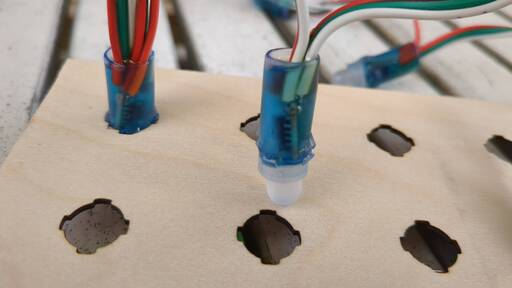](docs/01.jpg)

Wichtig! Der LED-Strang hat eine "Richtung". Die erste LED muss die mit diesem Stecker sein:

[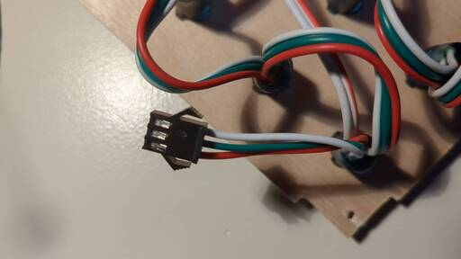](docs/02.jpg)

Wenn man die LEDs bis zur richtigen Tiefe durchsteckt, kann man sie durch Drehen arretieren:

[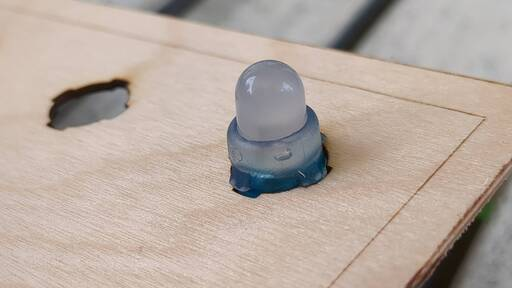](docs/03.jpg)

Die letzte überzählige LED wird abgeschnitten. Die Buchse wird auch abgeschnitten, die brauchen wir im nächsten Arbeitsschritt :-)

[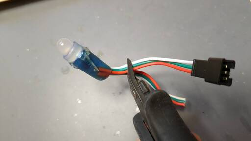](docs/04.jpg)

### Controller anlöten

Wichtig ist hier, auf die korrekte Polung zu achten. 
Vertauschen von Plus und Minus führt zum unmittelbaren Tod des Controllers.

* Plus- und Minuskabel (ca. 5 cm lang) für die Stromversorgung des Controllers vorbereiten (verzinnen)
* Kabel der abgeschnittenen Buchse vorbereiten (verzinnen)
* Die beiden Stromkabel an den Controller (an 5V und G) löten
* Das grüne Kabel aus der Buchse (Daten) an D4 löten

[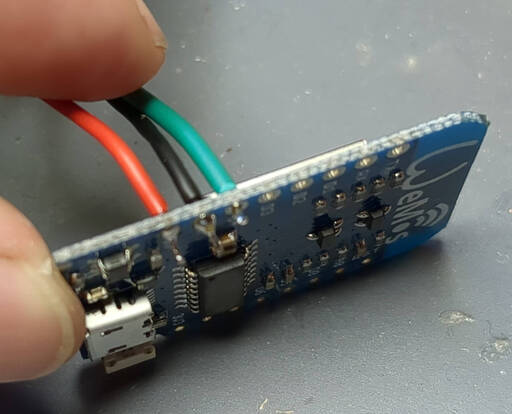](docs/05.jpg)

* Buchse in die Öffnung eines Rahmenwinkels stecken
* Das rote Kabel der abeschnittenen Buchse und das Pluskabel des Controllers (hoffentlich auch rot) an den Pluspol
  der Buchse löten (die kürzere Fahne - sicherheitshalber mit Multimeter nachmessen!)
* Das weiße Kabel der abeschnittenen Buchse und das Minuskabel des Controllers an die Minus-Seite löten

[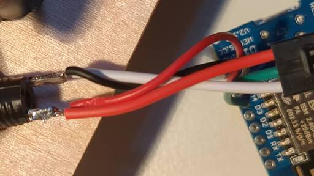](docs/06.jpg)

Wenn schon feststeht, welche Software verwendet werden soll:
Eventuell ist es praktisch, diese jetzt zu flashen, da der Controller momentan einfach zu erreichen ist.

### Verfachung und Rahmen

Nun werden die vier Ecken an die Rückplatte geschraubt.

[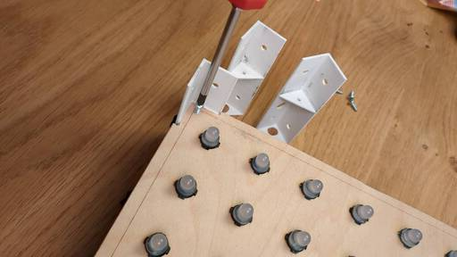](docs/07.jpg)

Die Ecke mit dem Controller kommt in die Ecke mit der ersten LED (mit Stecker).
Stecker und Buchse werden zusammengesteckt.

Die Außenwände werden mit den Musterbeutelklammern befestigt.
Bitte darauf achten, dass die Klammern innen möglichst flach anliegen und senkrecht stehen:

[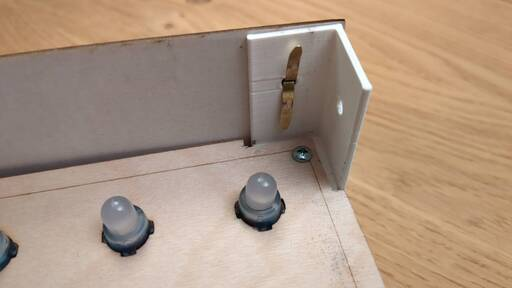](docs/08.jpg)

Wenn man keine scharf umrissenen Pixel will, kann man hier aufhören und
den Diffusor aufkleben. Im Ergebnis sieht das dann in etwa so aus:

[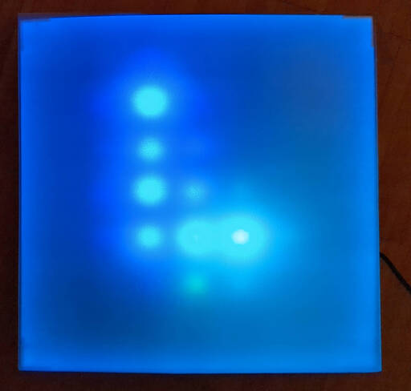](docs/15.jpg)

Wer hingegen klar umrissene Pixel will, muss die Verfachung zusammenstecken.
Es gibt drei verschiedene Pappstreifen:

Aus den oberen beiden (sie sind ein wenig kürzer) wird ein Rahmen zusammengesteckt:

[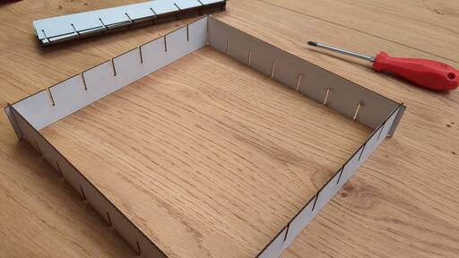](docs/10.jpg)

Nun kommen die restlichen Streifen der Reihe nach in die Schlitze:

[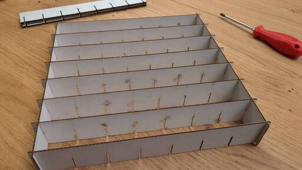](docs/11.jpg)

Umdrehen, und das ganze in die andere Richtung.
Am geschicktesten ist es, man beginnt in der Mitte:

[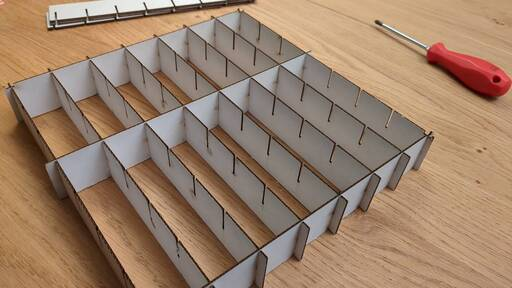](docs/12.jpg)

Am Ende wird der Rahmen vorsichtig eingesetzt (die Aussparungen passen über die Schrauben):

[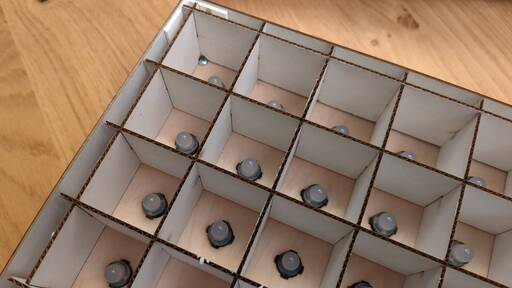](docs/13.jpg)

Zu guter letzt wird aus dem Transparentpapier ein Diffusor ausgeschnitten und über den Rahmen geklebt.
Nun entstehen scharf umrissene Pixel:

## Flashen und Konfiguration WLED

**Wichtig!** Bevor ihr den Controller per USB an einen Rechner anschließt:

* Trennt die LEDs mit dem Stecker vom Controller
* Entfernt das Netzteil

Die LEDs sind über den WS2811 individuell adressierbar.
Wer Muße hat, kann mit Hilfe von Bibliotheken wie z.B. [FastLED](https://fastled.io/) seine eigene Steuerung schreiben.

Wer schnell Ergebnisse sehen will, flasht den Controller mit [WLED](https://kno.wled.ge/basics/install-binary/).
Dies kann sehr einfach mit dem [WLED Web Installer](https://install.wled.me/) geschehen.

Nach dem ersten Einschalten meldet sich der Controller als WLAN-Access-Point.
Hier kann man nun das WLAN, mit dem sich der Controller verbinden soll, einstellen.
Ist das konfigurierte WLAN nicht (mehr) erreichbar, geht WLED automatisch wieder in den Access-Point-Modus.

Nach dem Start muss der angelötete LED-Streifen konfiguriert werden:

* Config - LED Preferences:
  * Enable automatic brightness limiter - an
  * Maximum Current - 2500 mA
  * LED voltage: 5 V
  * LED outputs: WS281x, Color Order GRB, Length 49
* Config - 2D Configuration
  * Strip or panel: 2D Matrix
  * Panel dimensions: 7 x 7

Etwas unintuitiv ist, dass WLED nach einem Neustart das zuletzt gewählte Muster vergessen hat.
Möchte man ein Muster als "Default beim Einschalten", so kann man dies folgendermaßen erreichen:

* Gewünschten Effekt wählen und konfigurieren
* Preset anlegen (+ Preset). Preset-Nummer merken
* Config - LED Preferences: Defaults - Apply preset: Hier die Nummer einstellen

